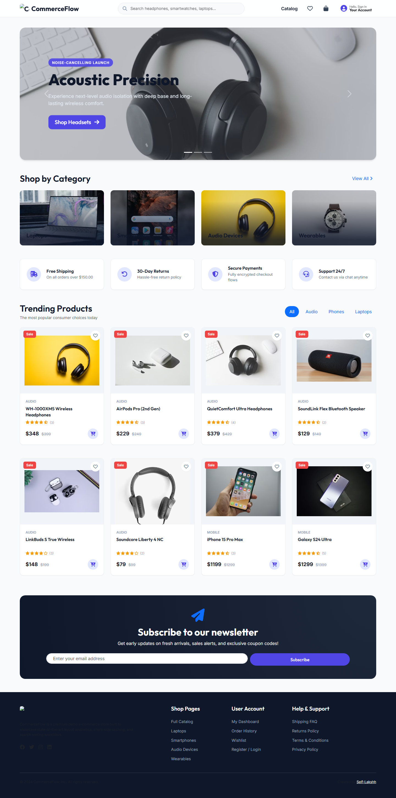
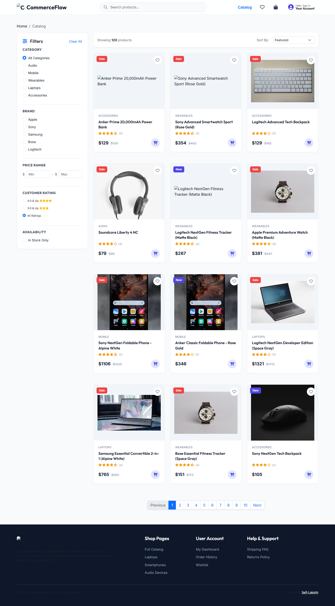
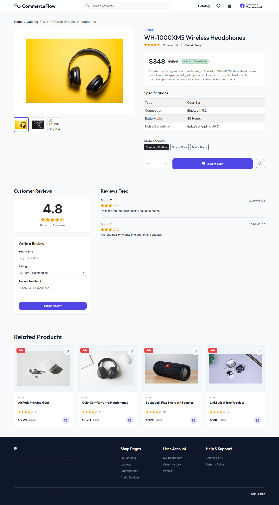
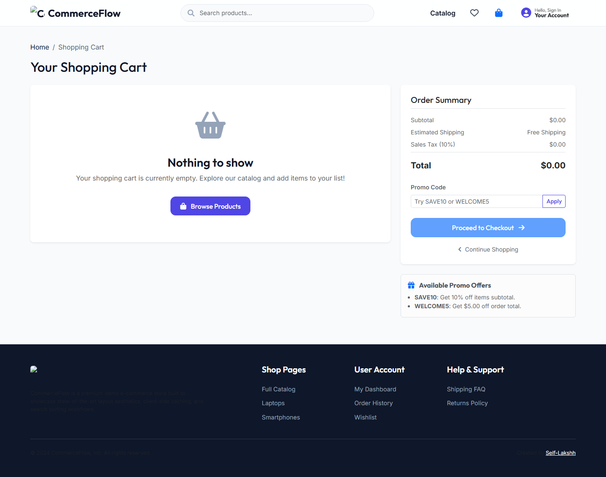
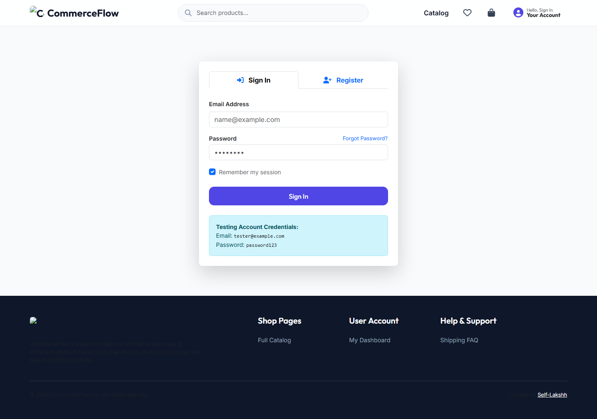

<div align="center">


# CommerceFlow

**A premium, production-quality E-Commerce storefront — built from first principles using HTML5, CSS3, Bootstrap 5.3, and modular Vanilla ES6+ JavaScript.**

[](https://github.com/Self-Lakshh/E-Commerce-Website/releases)
[](https://developer.mozilla.org/en-US/docs/Web/HTML)
[](https://developer.mozilla.org/en-US/docs/Web/CSS)
[](https://getbootstrap.com/)
[](https://developer.mozilla.org/en-US/docs/Web/JavaScript)
[](https://vitejs.dev/)
[](LICENSE)

[🌐 Live Demo](#) · [📖 Docs](docs/) · [🗺️ Roadmap](ROADMAP.md) · [📝 Changelog](CHANGELOG.md)

</div>

---

## 📸 Screenshots

### 🏠 Homepage — Hero, Categories & Featured Products


### 🛍️ Product Catalog — Filters, Search & Sorting


### 📦 Product Detail — Specs, Reviews & Add to Cart


### 🛒 Shopping Cart — Summary, Coupons & Subtotal


### 💳 Checkout — Multi-step Billing, Shipping & Payment


### 👤 User Dashboard — Profile, Orders & Wishlist


### 🔐 Auth Page — Login & Registration Forms


---

## ✨ Overview

**CommerceFlow** is a fully client-side, zero-backend consumer tech storefront engineered to demonstrate modern front-end architecture at scale. It encompasses **7 pages**, **120 dynamically generated products**, and a rich suite of UX interactions — all powered purely by HTML, CSS, and Vanilla JavaScript, without a single framework dependency.

> 💡 **Perfect for**: Front-end portfolio projects, UI/UX design references, e-commerce layout patterns, and client-side state management study.

---

## 🚀 Features

### 🛍️ Dynamic Product Catalog
- **120-item mock database** across 5 categories: Audio, Mobile, Wearables, Laptops, and Accessories
- **Real-time text search** matching across product titles, brands, categories, and descriptions
- **Multi-dimensional filters**: category, brand (multi-select), price range, star rating threshold, and in-stock availability toggle
- **4 sorting modes**: Featured (weighted score), Price Low→High, Price High→Low, Top Rated
- **12-per-page pagination** with smart Previous/Next controls and page number links
- **Skeleton shimmer loaders** simulating async network delays before results render
- **Empty state illustrations** with descriptive guidance when filters yield no matches

### 🛒 Cart & Wishlist Management
- Add to cart or wishlist from any page — Homepage, Catalog, or Product Detail
- **Persistent state** stored in `localStorage` — survives page reloads and tab switches
- **Real-time badge counters** on navbar icons reflect cart and wishlist item counts
- Adjust quantity (+/-) or trash individual items directly inside the cart page
- **Promo coupon system**: Apply `SAVE10` (10% off) or `WELCOME5` ($5 off) coupon codes
- Live subtotal, shipping estimate, and order total calculation
- Animated floating **toast notifications** confirm every cart/wishlist action instantly

### 💳 Simulated Checkout Flow
- **3-step wizard**: Billing Address → Shipping Method → Payment Review
- Form validation with inline error messages per field
- Dynamic **shipping courier rates** (Standard, Express, Next-Day) with time estimates
- Credit card input formatting with live validation
- Order confirmation receipt generated with a unique order ID stored in `localStorage`

### 🔐 Mock Authentication System
- Local **user registration** with email uniqueness checks and password confirmation
- **Session persistence** across the entire storefront via `localStorage` session tokens
- Auth-aware navbar: dynamically switches between Login button and user avatar/dropdown
- **User Dashboard** tabs: Profile & Address Management, Order History, Wishlist

### 🎨 Premium Aesthetic UX
- **Glassmorphism-inspired cards** with soft shadows and hover lift effects
- **Hero carousel** with animated overlaid text and CTA buttons
- Category grid with image overlay and smooth scale-on-hover animations
- Fully **responsive layout** from mobile (375px) to ultrawide desktops (1920px+)
- `localStorage`-backed newsletter subscription confirmation with coupon reward
- Micro-animations on buttons, product cards, badges, and navigation elements

### 🧪 QA Test Runner
- Integrated **browser-based unit test suite** (`tests/index.html`)
- Tests cover: Cart calculation math, coupon logic, product filter engine, auth session handling
- Visual pass/fail display with assertion counts — no build tools required

---

## 🗂️ Project Structure

```
E-Commerce-Website/
├── index.html              # Homepage — hero carousel, category grid, trending products
├── catalog.html            # Full product catalog with sidebar filters & pagination
├── product.html            # Individual product detail — specs, reviews, related items
├── cart.html               # Shopping cart — quantity controls, coupons, order summary
├── checkout.html           # 3-step checkout wizard — billing, shipping, payment
├── auth.html               # Login / Register / Password-Reset forms
├── dashboard.html          # User profile, order history, wishlist management
│
├── src/
│   ├── css/
│   │   └── style.css       # Complete design system — tokens, components, animations
│   └── js/
│       ├── products.js     # 120-item products DB + search/filter/sort engine
│       ├── ui.js           # Shared UI helpers — toasts, skeletons, stars, empty states
│       ├── cart.js         # CartManager — add/remove/qty/coupon, localStorage sync
│       ├── wishlist.js     # WishlistManager — toggle/query, localStorage sync
│       ├── auth.js         # AuthManager — register/login/session, localStorage persist
│       ├── checkout.js     # CheckoutManager — order generation, receipt storage
│       └── app.js          # Global bootstrap — navbar auth state, badge updates
│
├── tests/                  # Browser-native unit test runner
├── docs/                   # Architecture notes, design decisions, dev journal
│   └── screenshots/        # Page screenshots for documentation
├── mock-data/              # Static seed data references
├── package.json            # Vite dev-server config
├── CHANGELOG.md            # Release history
├── CONTRIBUTING.md         # Branching, commit style, and coding standards
└── ROADMAP.md              # Planned future feature phases
```

---

## ⚡ Installation & Setup

### Prerequisites
- [Node.js](https://nodejs.org/) v16+ (for Vite dev server)
- A modern browser (Chrome, Firefox, Edge, Safari)

### Quick Start

```bash
# 1. Clone the repository
git clone https://github.com/Self-Lakshh/E-Commerce-Website.git
cd E-Commerce-Website

# 2. Install dependencies (only Vite for dev server)
npm install

# 3. Start the development server
npm run dev
```

Then open **[http://localhost:5173](http://localhost:5173)** in your browser.

> **Alternatively**, just open `index.html` directly in your browser — no build step needed.

### Build for Production

```bash
npm run build    # Outputs optimized bundle to /dist
npm run preview  # Preview the production build locally
```

---

## 🔑 Test Credentials

Log in immediately with these pre-seeded test credentials:

| Field    | Value                   |
|----------|-------------------------|
| Email    | `tester@example.com`    |
| Password | `password123`           |

Or register a new account directly on the [Auth page](auth.html).

---

## 🎟️ Promo Coupon Codes

Apply these codes in the cart to activate discounts:

| Coupon Code  | Discount         |
|--------------|------------------|
| `SAVE10`     | 10% off subtotal |
| `WELCOME5`   | $5 off subtotal  |

---

## 🧠 Architecture Highlights

### State Management
All application state (cart items, wishlist, session user, order history) is serialized to **`localStorage`** using dedicated manager modules. Each manager dispatches custom DOM events (e.g., `cf-cart-updated`, `cf-auth-changed`) that other modules listen to for reactive badge and UI updates — creating a lightweight pub/sub system without any external library.

### Product Query Engine
The `ProductEngine` (`src/js/products.js`) implements a composable, filter-chaining query pipeline that:
1. Applies text search against title + brand + category + description
2. Filters by category radio, multi-brand checkboxes, price range, minimum rating, and stock status
3. Sorts the result set by one of 4 strategies
4. Returns the full result array for paginating at the caller level

### Skeleton Loading UX
Every catalog rendering call first replaces the container with animated shimmer placeholder cards for **600ms**, simulating realistic network latency before the actual product grid renders. This provides a polished perceived performance feel even with synchronous JS data.

---

## 🧪 Running Tests

Open the built-in browser test runner in your browser:

```
http://localhost:5173/tests/index.html
```

Or open `tests/index.html` directly. The test suite covers:
- ✅ Cart item addition, deduplication, and quantity clamping
- ✅ Promo coupon math (`SAVE10`, `WELCOME5`)
- ✅ Product filter engine search, category, price, and rating queries
- ✅ Auth session storage and login/logout state persistence

---

## 🗺️ Roadmap

| Phase   | Status      | Description                                                         |
|---------|-------------|---------------------------------------------------------------------|
| Phase 1 | ✅ Complete  | Core layout, 120-item catalog, cart/wishlist, auth, checkout wizard |
| Phase 2 | ✅ Complete  | Skeleton loaders, toast notifications, empty states, unit tests     |
| Phase 3 | 🔜 Planned   | Firebase Auth + Firestore product sync + Cloud Storage avatars      |
| Phase 4 | 🔜 Planned   | Admin dashboard — product management, order tracking, sales charts  |

See [ROADMAP.md](ROADMAP.md) for full sprint details.

---

## 🤝 Contributing

Contributions, issues, and feature requests are welcome! Please read [CONTRIBUTING.md](CONTRIBUTING.md) before submitting a pull request.

**Branch naming:**
- `feature/your-feature-name`
- `bugfix/issue-description`

**Commit prefixes:** `feat:`, `fix:`, `docs:`, `refactor:`, `perf:`

---

## 📄 License

Distributed under the **MIT License**. See [`LICENSE`](LICENSE) for more information.

---

<div align="center">

**Built with ❤️ by [Self-Lakshh](https://github.com/Self-Lakshh)**

⭐ **Star this repo if you found it useful!**

</div>
